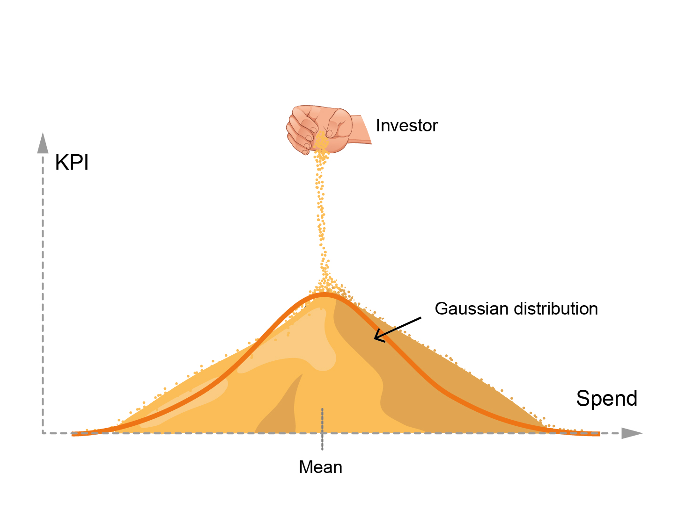

### Turn the numbers into the human story.

---

A marketing mix model gives you one number per channel and a way to split the budget. That number is a mean, the center of a distribution, and statistics is clear about one thing: a mean without its spread is only half the answer.

<em>The number your model reports is the peak. The decision lives in the width and the tails.</em>

When the model says a channel drove five percent, that five percent is the middle of a range. The width tells you how far to trust it. The grains far from the mean, the tails, are not noise: they are the customers, the moments and the contexts where a channel behaves nothing like its average. Audica reads the whole pile, not just the peak.

Let me show you what that looks like on a real advertiser.

## Audica in action

Take a retail advertiser, five channels, real money. This is what a marketing mix model hands you at the end of the engagement.

A clean waterfall. A contribution for every channel and a return beside it. Eighty three percent sits in baseline, the part media never moved, and the five channels split what is left: TV the biggest at 5.6 percent, then Google at 4.6, with Facebook, Print and Out of Home behind. The return column already whispers something: only Google and Print hand back more than a euro for every euro spent, at 1.87 and 1.34. TV, Facebook and Out of Home come back under one, at 0.93, 0.75 and 0.45. Useful, and still not enough. You now know the size of each channel and roughly its efficiency. You still do not know who is on the other end, or whether spending more would buy you anything. A number is a suit: it tells you the size, not the person wearing it.

Audica takes the same spend and the same results and asks two questions the table cannot answer. Does the channel grow when you feed it, and does its audience talk to each other.

Two questions, two axes. Placed that way, the five channels stop being a list and become characters.

**TV and Google Search** sit top left. Both scale: spend more and you get more. But their audience is a set of strangers who never talk to each other. These are your reach engines, the place you go to get in front of new people. The difference between them is in the return column, not on the map. Google scales and pays back almost two to one, so you feed it without hesitation. TV scales too, but at ninety three cents on the euro it is buying reach at roughly breakeven. Real, worth having, but watch its size.

**Print and Facebook** sit bottom right, and they are the opposite animal. More money buys little more, they do not scale. But both reach a real community, a connected crowd where word of mouth compounds. You do not grow these by spending, you protect them. And here the return tells two different stories: Print quietly pays back at 1.34, so it is cheap to keep and profitable, while Facebook comes back at 0.75. On Facebook the value is the room itself, the loyal audience that keeps your brand alive by talking about it, not the immediate payback.

**Out of Home** sits bottom left. It does not scale, it connects no one, and it hands back the least of all, forty five cents on the euro. A habit you are still funding. Question it.

Then Audica reads the part every standard tool leaves out. The channels are not islands. Feed one, and another moves.

Read it top to bottom, like a shopping list. Feed **TV** and it quietly eats **Google**, ten points come off Google's contribution while TV takes the credit. Feed **Out of Home** or **Print** and Google rises without anyone noticing. Feed **Google** and Facebook climbs. And **Facebook** is the engine of the whole system: spend on it and both TV and Google lift, but Print and Out of Home fall. Orange lifts the other, green takes from it. The grey bars near zero matter too. They mark where there is no echo, so you do not invent one.

Now you are not splitting a budget by a table of returns. You are making a decision you can defend in front of your client. Feed Google, it scales and it pays. Hold TV to the reach it is actually worth, and remember it is quietly feeding on that Google. Protect Print and Facebook, the connected crowd, where cutting spend saves little and losing the room costs everything, and note that Print is paying its own way. Treat Facebook as the lever that moves the others, not as one more line in a table.

That is the difference between handing a client a spreadsheet and telling a client who their audience is. One gets questioned on price. The other gets you the next brief.

This is not a demo. It comes from real advertisers spending real money.

## How it works

For the technically minded, briefly.

Audica is a marketing mix model, not a dashboard placed on top of one. It is built on a proven open source Bayesian engine, with two changes.

Each channel's response is fitted to a new equation rather than the standard saturation curve. That equation was benchmarked against the usual curves and validated on real data, accepted at SICon 2025, and its parameters are what place each channel on the map: how much it grows with spend, and whether its audience is a connected crowd or a set of individuals.

And it models how channels feed each other, the cross channel halo that standard tools leave out, using Boltzmann equations inside the model itself. As far as I know, no other marketing mix model does this.

The approach was tested on close to a hundred real advertiser datasets, shared under NDA, before any of it reached a paper. Real data, anonymized, but pure reality.

*Open source, Apache 2.0. Research presented in the Third Workshop on Social Influence in Conversations (ACL-Sicon 2025). Built by Javier Marín.*
