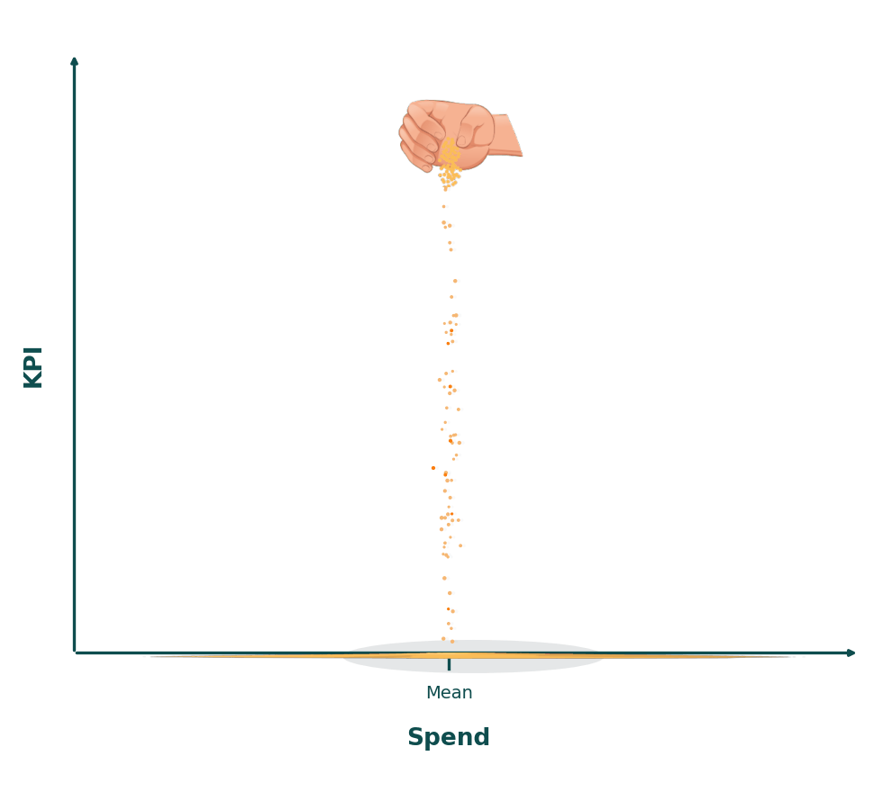
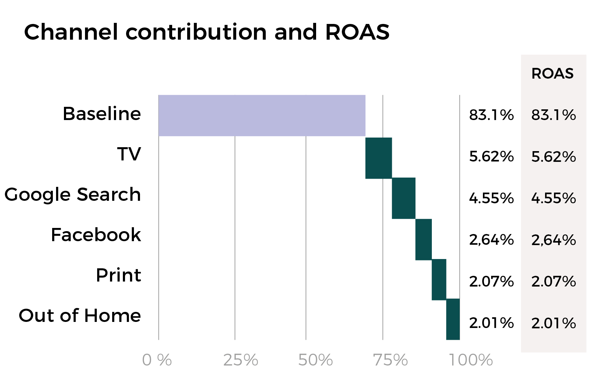
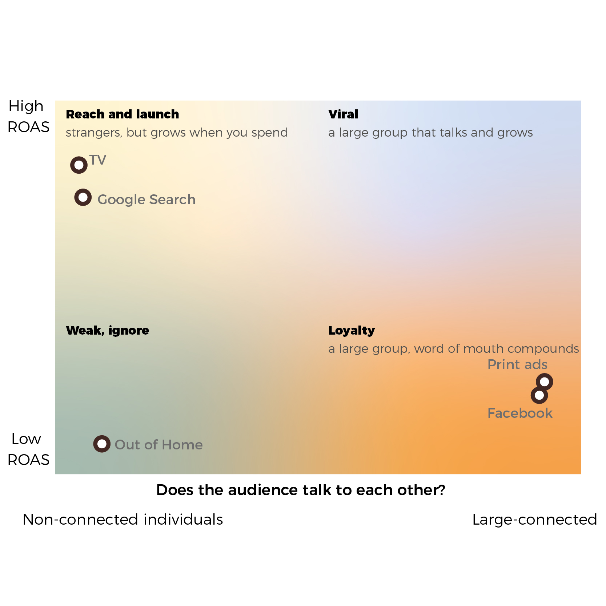
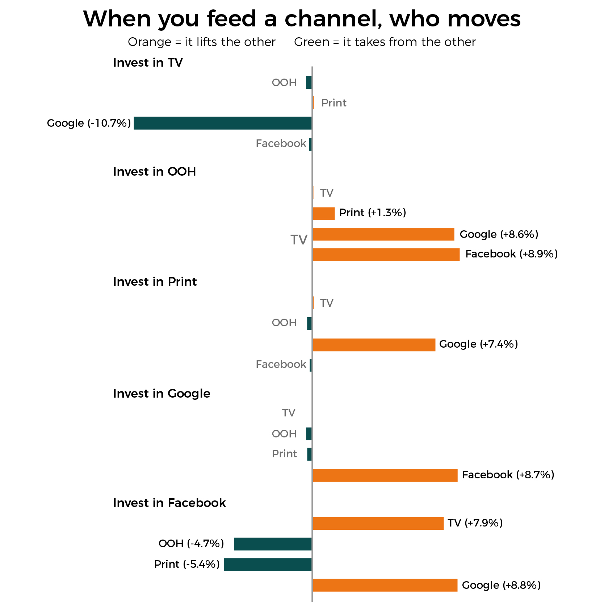

Audica reads your brand, not just your budget. The step from Marketing Mix Modelling to Brand Mix Modelling.

## Do we trust a single number?

A MMM reports one figure per channel. Reality is not one figure. It is a pile of sand, poured cent by cent, lumpy, with grains thrown wide. The number is the top of the pile. Practical. Not the whole truth.

Your clients live in the shape of this pile, not the peak.

## Who it is for

The people who answer for a brand's growth. CMOs, Brand Owners, Brand Strategists, Product Managers.

---

## One run, start to finish

Let's see an example. One advertiser, five channels, real money. An example of what audica does.

### What a MMM gives you.

Size and return, channel by channel. And eighty three percent it files under baseline and forgets. That eighty three percent is **your brand**, your most important asset.

### What audica gives you. 

Every cent is doing one of three jobs:

#### Harvest
It collects demand that already existed. Search stands at the door people were already walking through. High return, creates nothing.

#### Plant
It creates demand that was not there. Television makes a stranger want. Slower, dearer, and the only reason there is a harvest next year.

#### Brand
It stopped answering to spend and became who you are. Feed Print or Facebook and nothing moves, because you cannot buy more of a community than it already is.

Out of Home does none of the three. Cut it.

Which job is which. Two questions the table cannot answer: does the channel grow when you feed it, and does its audience talk to each other.

Reach engines top left, strangers who scale. Community bottom right, a crowd that compounds. Out of Home at the bottom, neither.

And they are not islands. Feed one, another moves.

Feed the community and both TV and Google lift, while Print and Out of Home fall. That fall is not damage. It is migration. Their credit goes home to the baseline, to the brand. An ad becoming brand, caught in the act.

So you are not splitting a budget any more. You are deciding which relationships to grow and which to protect, and you can defend it in the room.

### We show you the moment an ad stops being an ad and becomes your brand.

*Open source, Apache 2.0. Research presented at the Third Workshop on Social Influence in Conversations (ACL-SiCon 2025). Built by Javier Marín.*
